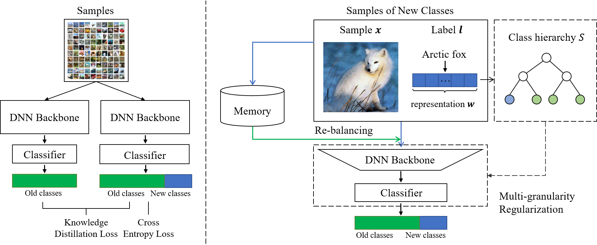

# Multi-Granularity Regularized Re-Balancing for Class Incremental Learning

Paper: [https://ieeexplore.ieee.org/document/9815145](https://ieeexplore.ieee.org/document/9815145)

### Brief Introduction

Data imbalance between old and new classes is a key issue that leads to performance degradation of the model in incremental learning. In this study, we propose an assumption-agnostic method, Multi-Granularity Regularized re-Balancing (MGRB), to address this problem. Re-balancing methods are used to alleviate the influence of data imbalance; however, we empirically discover that they would under-fit new classes. To this end, we further design a novel multi-granularity regularization term that enables the model to consider the correlations of classes in addition to re-balancing the data. A class hierarchy is first constructed by ontology, grouping semantically or visually similar classes. The multi-granularity regularization then transforms the one-hot label vector into a continuous label distribution, which reflects the relations between the target class and other classes based on the constructed class hierarchy. Thus, the model can learn the inter-class relational information, which helps enhance the learning of both old and new classes. Experimental results on both public datasets and a real-world fault diagnosis dataset verify the effectiveness of the proposed method. 





> The figure on the left shows the structure of the baseline method, and the figure on the right is the overview of our MGRB method. The proposed model has two significant parts compared with the baseline: (1) re-balancing modeling. We use the re-balancing strategies during training to alleviate the influence of data imbalance; and (2) multi-granularity regularization. A multi-granularity regularization term is designed to make the model consider class correlations. Through end-to-end learning, both old and new classes can be better learned.

### Environment

- Python 3.7
- Pytorch 1.8.1
- CUDA 11.2

### Requirement

+ See `requirements.txt` for environment.
+ The pre-trained word vector library can be found [here](https://code.google.com/archive/p/word2vec/). You can download it or download the library used in this paper [here](https://drive.google.com/file/d/1xZEbpkDXZF_rlH9hBIq-WE_RQ5sNg3hp/view?usp=sharing).

### Results

The experimental results on the CIFAR100 are as follows：

<table>
    <tr>
        <td rowspan="2">Methods</td>
        <td colspan="2">CIFAR100-10/10</td>
        <td colspan="2">CIFAR100-20/20</td>
        <td colspan="2">CIFAR100-50/5</td>
        <td colspan="2">CIFAR100-50/10</td>
    <tr>
        <td>last</td><td>Avg acc</td>
        <td>last</td><td>Avg acc</td>
        <td>last</td><td>Avg acc</td>
        <td>last</td><td>Avg acc</td>
    <tr>
        <td>LwF</td><td>28.18</td><td>49.33</td><td>39.49</td><td>57.49</td><td>33.75</td><td>46.30</td><td>39.28</td><td>52.19</td>
    <tr>
    	<td>iCaRL</td><td>45.72</td><td>59.96</td><td>50.33</td><td>63.23</td><td>43.97</td><td>52.93</td><td>46.71</td><td>57.06</td>
    <tr>
        <td>LUCIR</td><td>41.86</td><td>56.57</td><td>50.15</td><td>62.64</td><td>50.12</td><td>60.37</td><td>50.55</td><td>61.95</td>
    <tr>
        <td>Mnemonics</td><td>42.42</td><td>58.53</td><td>48.95</td><td>63.18</td><td>50.79</td><td>60.43</td><td>53.58</td><td>63.12</td>
    <tr>
        <td>BiC</td><td>47.30</td><td>57.56</td><td>40.90</td><td>48.33</td><td>41.63</td><td>54.11</td><td>50.88</td><td>58.35</td>
    <tr>
        <td>Ours-CNN(ont)</td><td>45.81</td><td>61.02</td><td>56.03</td><td>66.45</td><td>52.59</td><td>61.50</td><td>58.20</td><td>65.45
	<tr>
		<td>Ours-CNN(vis)</td><td>47.72</td><td><b>62.38</b></td><td>57.00</td><td><b>68.27</b></td><td>52.69</td><td><b>61.51</b></td><td>58.63</td><td><b>65.69</b> 
	<tr>
		<td>PODNet</td><td>39.50</td><td>54.14</td><td>50.10</td><td>62.94</td><td>53.70</td><td>62.35</td><td>55.30</td><td>63.75
	<tr>
		<td>Ours-PODNet</td><td>40.70</td><td><b>54.61</b></td><td>50.70</td><td><b>63.44</b></td><td>53.90</td><td><b>62.85</b></td><td>55.10</td><td><b>64.32</b> 
	<tr>
		<td>AANets-iCaRL</td><td>45.32</td><td>61.40</td><td>51.75</td><td>65.40</td><td>47.91</td><td>59.79</td><td>50.24</td><td>61.71 
	<tr>
		<td>Ours-AANets</td><td>45.63</td><td><b>63.02</b></td><td>49.42</td><td><b>65.72</b></td><td>47.33</td><td><b>59.93</b></td><td>50.26</td><td><b>62.19</b> 
	<tr>
		<td>DER</td><td>57.25</td><td>65.31</td><td>62.66</td><td>70.51</td><td>66.63</td><td>72.81</td><td>66.62</td><td>73.07 
	<tr>
		<td>Ours-DER</td><td>58.03</td><td><b>65.42</b></td><td>62.94</td><td><b>70.74</b></td><td>66.61</td><td><b>73.06</b></td><td>66.82</td><td><b>73.27</b> 
	<tr>
    <tr>
</table>

### File organization

The `demo` folder provides a demo version of the proposed multi-granularity regular term, which can be easily added to [PODNet](https://github.com/arthurdouillard/incremental_learning.pytorch), [AANets](https://github.com/yaoyao-liu/class-incremental-learning/tree/main/adaptive-aggregation-networks), and [DER](https://github.com/Rhyssiyan/DER-ClassIL.pytorch/).

The `code` folder provides the complete code for MGRB.

```
├── data                    # dataset and nodepathinfo
├── demo
    ├── save                # data preprocessing file
    ├── parser.py           # add parameters
    ├── loss.py             # return loss
    ├── cal_MG.py           # calculate the multi-granularity regularization term
    ├── util.py             
    └── ...
├── code
    ├── save                # data preprocessing file
    ├── divide___.py        # data split
    ├── Load___.py          # data loader
    ├── etrain.py           # train and test
    ├── model.py            # network
    ├── cal_MG.py           # calculate the multi-granularity regularization term
    ├── cal_RB.py           # calculate the weight for class re-balancing loss
    └── util.py
```

### Citation

If you use this paper/code in your research, please consider citing us:

~~~txt
H. Chen, Y. Wang and Q. Hu, "Multi-Granularity Regularized Re-Balancing for Class Incremental Learning," in IEEE Transactions on Knowledge and Data Engineering, 2022, doi: 10.1109/TKDE.2022.3188335.
~~~

~~~txt
@ARTICLE{9815145,
  author={Chen, Huitong and Wang, Yu and Hu, Qinghua},
  journal={IEEE Transactions on Knowledge and Data Engineering}, 
  title={Multi-Granularity Regularized Re-Balancing for Class Incremental Learning}, 
  year={2022},
  volume={},
  number={},
  pages={1-15},
  doi={10.1109/TKDE.2022.3188335}}
~~~


